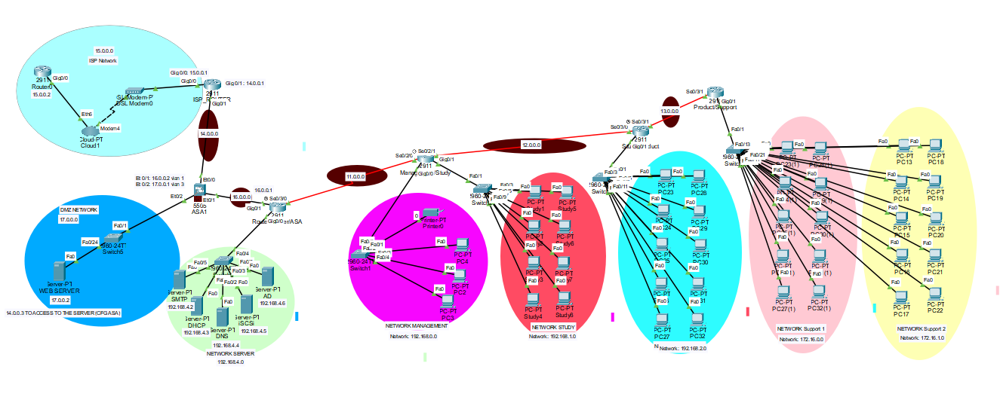
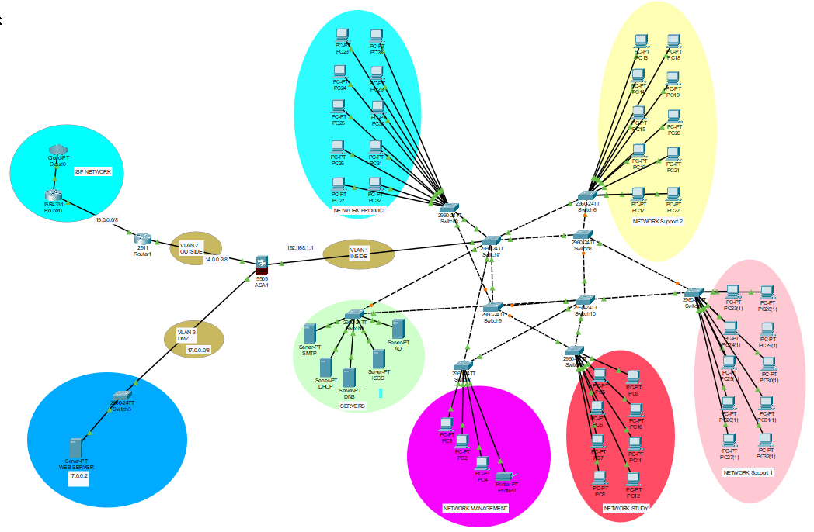

# Project: Establish a Secure Network
Project type: Group  
Project files:
[router network.pkt](Group_project_router.pkt),
[switch network.pkt](Group_project_switch.pkt)

## Team members
[Cosimo](https://github.com/Cosimo-CS) 
[Edjane](https://github.com/)  
[Bukunmi](https://github.com/BUcodes) 

## Project Context
Your company faces an exciting challenge: designing a secure and efficient network for a client relocating to a new office. Their current setup requires modernization, and you're tasked with crafting a cost-effective, well-structured plan that optimizes resource allocation while adhering to stringent security best practices.

## Aim
- Design a scalable, secure and efficient network
- Deliver a clear and structured documentation

## Requirements:
- DHCP server
- iSCSI server
- Active Directory and DNS server
- DMZ concept (through VLANs and ACLs)
- Four network sectors :
    - Management/Secretariat (5 workstations)
    - Study (8 workstations)
    - Production (10 workstations)
    - Support (2 sectors, 10 workstations each) 

## Design: 
We developed 2 different network plans and compared their functionalities: one with routers, the other with switches as core networking devices.

### Router network:
**Physical connection**: End devices for each sector was connected to a switch, similarly for a cluster of servers. These switches were connected to routers which route network traffic between them. The firewall was setup at the network terminal to inspect traffic in and out of the network. DMZ comprising the company's web server was isolated at the other end of the firewall as shown in the network topology below.

**Logical connection**: Each sector was allotted a network IP address (_see addressing table below_). Dynamic addressing through DHCP was implemented for end devices except the servers. 

**Addressing table :**

|Sector | NETWORK | SUBNET | VLAN
|---------|-------|------|------|
|SERVER | 10.0.0.0	| 255.255.255.248 |	1
|MANAGEMENT	|192.168.0.0|255.255.255.224|1
|STUDY	|192.168.1.0	|255.255.255.0	|1
|PRODUCT	|192.168.2.0	|255.255.255.0	|1
|SUPPORT 1	|172.16.0.0	|255.255.0.0	|1
|SUPPORT 2	|172.16.1.0	|255.255.0.0	|2
|ASA/MANAGEMENT	|11.0.0.0	|255.255.255.248|	1
|STUDY/PRODUCT	|12.0.0.0	|255.255.255.248|	1
|PRODUCT/SUPPORT|	13.0.0.0|	255.255.255.248|	1
|ISP/ASA|	14.0.0.0	|255.255.255.248	|2
|ISP	|15.0.0.0	|255.255.255.248	|2
|SERVER/ASA	|16.0.0.0	|255.255.255.248	|1
|DMZ	|17.0.0.0	|255.255.255.248	|2

## Configurations Made
### 1. Addressing with DHCP
DHCP entries for each network sector was made by populating the DHCP table with ip addresses and corresponding sector names. 

### 2. Virtual-LAN with Firewall
Three vlans were setup to delineate the internal network from internet traffic and DMZ. The following priority levels were set: 

|NETWORK | VLAN | SECURITY LEVEL | REMARK
|---------|-----|----|------|
|Internal	|1	|100|Trusted
|Internet	|2	|0|	Untrusted
|DMZ|	3|	50|	Semi-trusted

## Switch Network
**Physical connection**:
For the switch network, the sectors were setup in similar fashion to the router network. However, the difference was that the switch network comprised mainly switches. These layer 2 switches were centrally located and interconnected for fault tolerance- when one switch is down the network function is not disrupted. This redundacy was achieved by connecting each sector switch to two (2) central switches as shown below.  

**Logical connection**:
Similar implementation as with the router network. However, no gateway IP configurations were made. The switches main function was to redistribute traffic in and out of the sectors.

## Security measures with Firewall
- Security-level configuration to restrict untrusted access into the network
- AAA authentication to allow for secure remote network connection
- Implemented policy map to inspect internet-bound traffic (_icmp, tcp_) from the network
- Setup access list controls on the DMZ to internet traffic to web server on restricted ports
- Network address translation (NAT) which translate the internal IP addresses for internet access

For visual view of the configurations made, you may consult the [file](Establish_a_secure_network.pkt) attached in this repository.
